<div align="center">

# 🔬 Enterprise Code Analyzer

### AI-Powered Code Intelligence Platform

[](https://python.org)
[](LICENSE)
[](https://black.readthedocs.io)

*Transform your Python codebase into actionable intelligence with deep analysis, RAG-powered AI assistance, and Python→Go transpilation.*

---

[Features](#-features) • [Quick Start](#-quick-start) • [Architecture](#-architecture) • [Usage](#-usage) • [Transpiler](#-python-to-go-transpiler)

</div>

---

## ✨ Features

<table>
<tr>
<td width="33%">

### 🔍 Deep Analysis
- AST-based parsing
- Multi-language support
- Type annotation analysis
- Full codebase indexing

</td>
<td width="33%">

### 📊 Smart Metrics
- Cyclomatic Complexity
- Cognitive Complexity
- Halstead Metrics
- Maintainability Index

</td>
<td width="33%">

### 🛡️ Security Scan
- SQL/Command Injection
- Hardcoded Secrets
- Vulnerable Patterns
- CVE Detection

</td>
</tr>
<tr>
<td width="33%">

### 🎯 Pattern Detection
- Design Patterns
- Anti-Patterns
- Code Smells
- Dead Code Analysis

</td>
<td width="33%">

### 🤖 RAG AI Assistant
- Natural Language Q&A
- Semantic Code Search
- Multi-Provider LLMs
- Persistent Vector Index

</td>
<td width="33%">

### 🔄 Code Transpiler
- Python → Go Conversion
- Type Mapping
- Control Flow Translation
- Directory Processing

</td>
</tr>
</table>

---

## 🏗️ Architecture

### System Overview

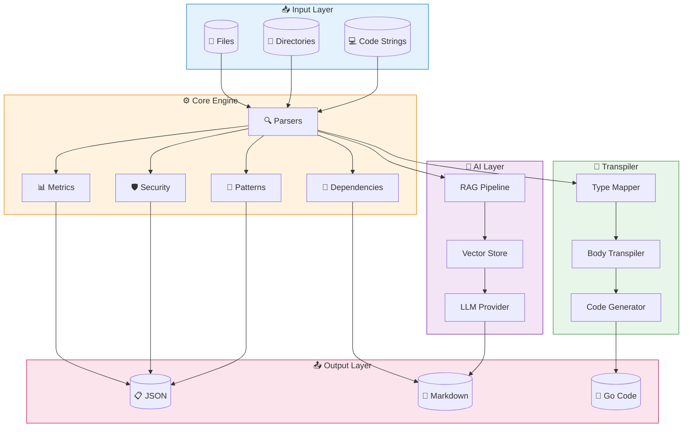

---

### Module Architecture

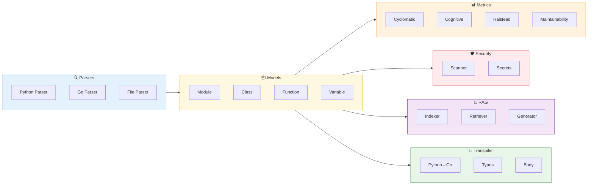

---

### Data Flow Pipeline

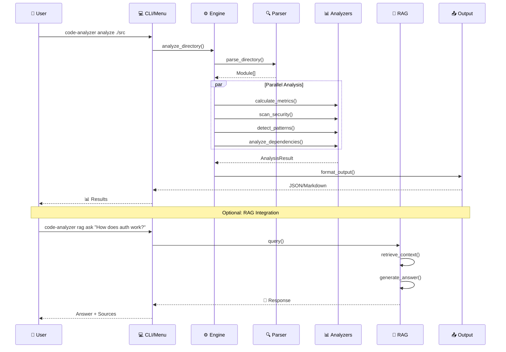

---

## 🚀 Quick Start

### Installation

```bash
# Clone repository
git clone https://github.com/yourusername/code-analyzer.git
cd code-analyzer

# Install with all features
pip install -e ".[dev,rag]"
```

### Interactive Menu

```bash
python -m analyzer.menu
```

```
╔════════════════════════════════════════════════════════════╗
║               🔬 ENTERPRISE CODE ANALYZER                   ║
║                 AI-Powered Code Intelligence                 ║
╠════════════════════════════════════════════════════════════╣
║  [1] 📂 Analyze File       [6] 🔗 Dependency Analysis       ║
║  [2] 📁 Analyze Directory  [7] 🔍 Query Code               ║
║  [3] 📊 Quick Metrics      [8] 📝 Generate Summary         ║
║  [4] 🔐 Security Scan      [A] 🤖 RAG AI Assistant         ║
║  [5] 🎯 Pattern Detection  [B] 🔄 Python→Go Transpiler     ║
╚════════════════════════════════════════════════════════════╝
```

---

## 📊 Analysis Capabilities

### Code Quality Metrics

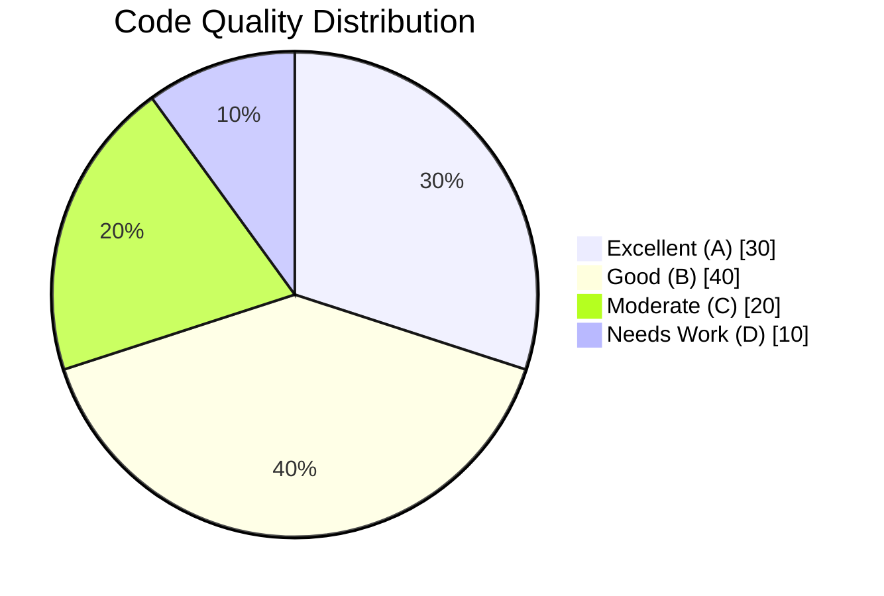

| Metric | Description | Threshold |
|--------|-------------|-----------|
| **Cyclomatic Complexity** | Control flow paths | < 10 ✅ |
| **Cognitive Complexity** | Human readability | < 15 ✅ |
| **Maintainability Index** | Overall health | > 65 ✅ |
| **Lines per Function** | Code organization | < 50 ✅ |

---

### Security Analysis

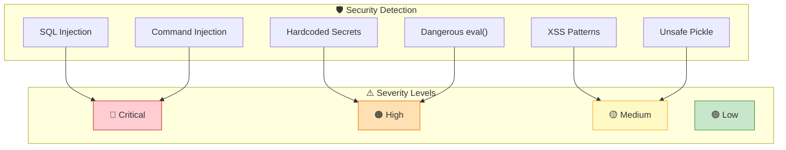

---

### Pattern Detection

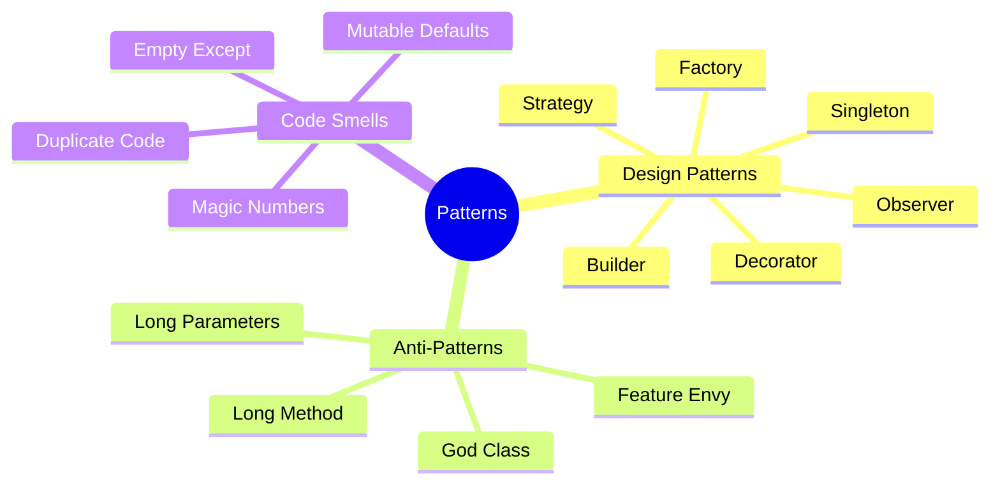

---

## 🤖 RAG AI Assistant

### Architecture

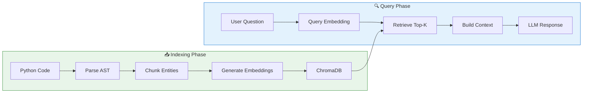

### Supported Providers

| Provider | Embeddings | LLM | Status |
|----------|------------|-----|--------|
| **OpenAI** | ✅ text-embedding-3 | ✅ GPT-4 | Production |
| **Anthropic** | — | ✅ Claude 3 | Production |
| **Google** | ✅ Gemini | ✅ Gemini Pro | Production |
| **Local** | ✅ SentenceTransformers | — | Development |

### Usage

```bash
# Index your codebase
code-analyzer rag index ./src

# Ask questions
code-analyzer rag ask "How does authentication work?"

# Semantic search
code-analyzer rag search "error handling patterns"
```

---

## 🔄 Python to Go Transpiler

### Transpilation Flow

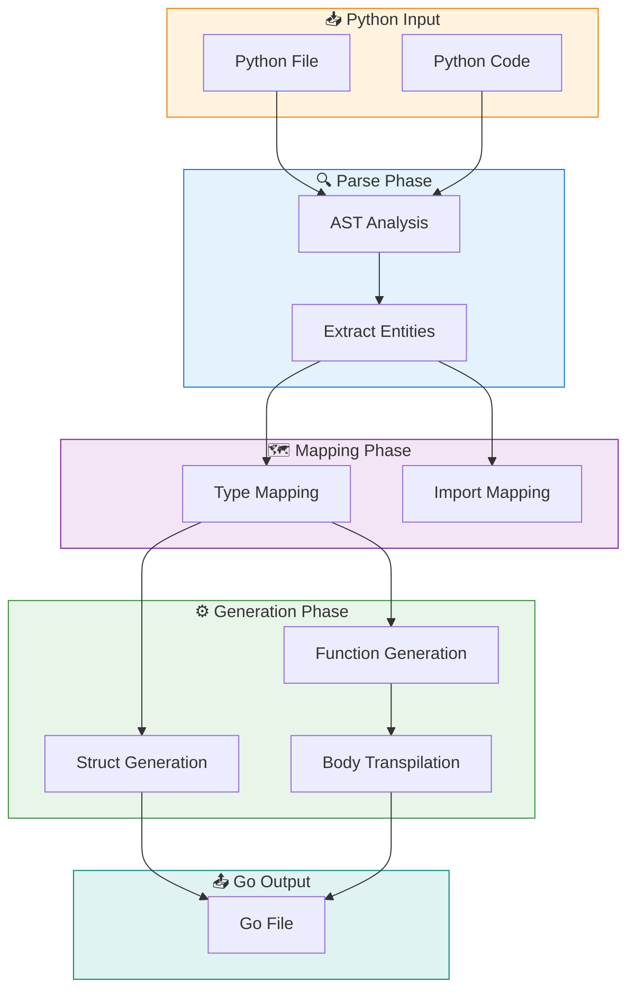

### Type Mapping

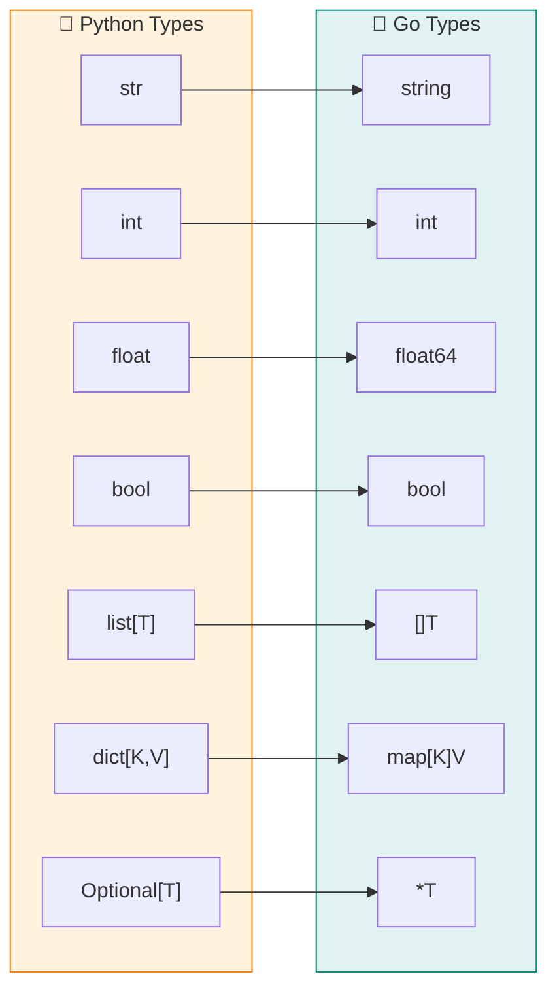

### Construct Mapping

| Python | Go | Support |
|--------|-----|---------|
| `class` | `struct` + methods | ✅ Full |
| `def function()` | `func Function()` | ✅ Full |
| `self.method()` | Receiver methods | ✅ Full |
| `__init__` | `NewType()` constructor | ✅ Full |
| `for x in items` | `for _, x := range items` | ✅ Full |
| `if/elif/else` | `if {} else if {} else {}` | ✅ Full |
| `while` | `for condition {}` | ✅ Full |
| `try/except` | `defer`/`recover` | ⚠️ Partial |
| List comprehensions | Loop expansion | ⚠️ Partial |

### Example

**Input: Python**
```python
def calculate_sum(numbers: list[int]) -> int:
    total = 0
    for num in numbers:
        total += num
    return total

class Calculator:
    def __init__(self, precision: int):
        self.precision = precision
    
    def add(self, a: float, b: float) -> float:
        return round(a + b, self.precision)
```

**Output: Go**
```go
package main

func CalculateSum(numbers []int) int {
    total := 0
    for _, num := range numbers {
        total += num
    }
    return total
}

type Calculator struct {
    Precision int
}

func NewCalculator(precision int) *Calculator {
    return &Calculator{
        Precision: precision,
    }
}

func (c *Calculator) Add(a float64, b float64) float64 {
    return math.Round((a + b) * math.Pow10(c.Precision)) / math.Pow10(c.Precision)
}
```

### Usage

```bash
# Transpile a single file
code-analyzer transpile main.py --output ./go/main.go

# Transpile entire directory
code-analyzer transpile ./python_project --output ./go_project

# With custom package name
code-analyzer transpile main.py --package myapp
```

---

## 💻 CLI Reference

### Commands

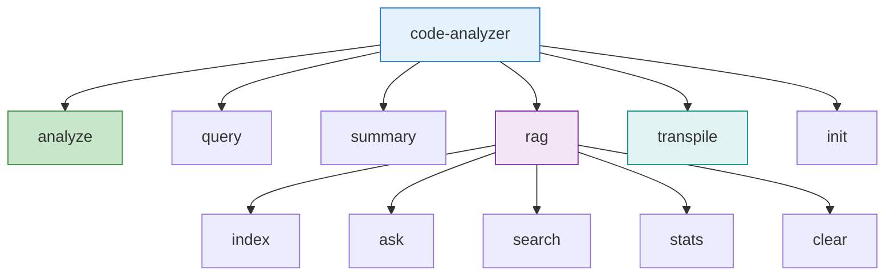

| Command | Description | Example |
|---------|-------------|---------|
| `analyze` | Analyze code | `code-analyzer analyze ./src` |
| `query` | Natural language query | `code-analyzer query ./src "find async"` |
| `summary` | Generate summary | `code-analyzer summary ./src` |
| `transpile` | Convert Python→Go | `code-analyzer transpile main.py` |
| `rag index` | Index for RAG | `code-analyzer rag index ./src` |
| `rag ask` | Ask AI about code | `code-analyzer rag ask "How does X work?"` |
| `init` | Create config | `code-analyzer init --format yaml` |

---

## ⚙️ Configuration

### Config File (`.code-analyzer.yaml`)

```yaml
# Parser Settings
parser:
  max_file_size_mb: 10
  encoding: utf-8
  languages:
    - python
    - go

# Metrics Thresholds
metrics:
  complexity_threshold_high: 20
  max_function_lines: 50
  maintainability_threshold: 65

# Pattern Detection
patterns:
  detect_design_patterns: true
  detect_anti_patterns: true
  detect_code_smells: true

# Security Scanning
security:
  check_sql_injection: true
  check_hardcoded_secrets: true
  check_dangerous_functions: true

# RAG Configuration
rag:
  embedding_provider: openai
  llm_provider: anthropic
  persist_directory: .analyzer_rag
  chunk_size: 1500
  top_k: 10

# AI Output
ai:
  max_context_tokens: 8000
  output_format: json
```

---

## 📁 Project Structure

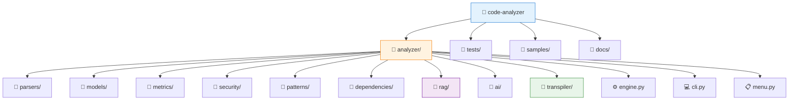

---

## 📈 Performance

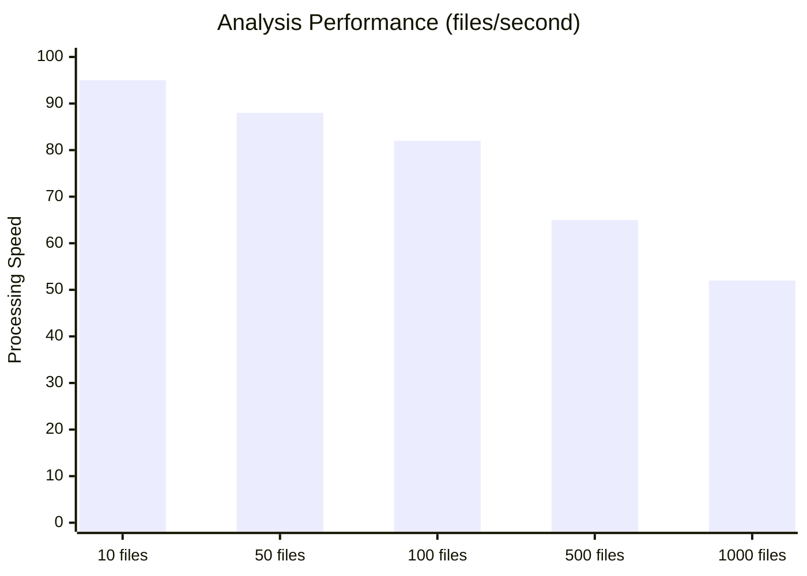

| Codebase Size | Analysis Time | Memory Usage |
|---------------|---------------|--------------|
| 1K LOC | < 1 sec | ~50 MB |
| 10K LOC | ~5 sec | ~100 MB |
| 100K LOC | ~30 sec | ~500 MB |
| 1M LOC | ~5 min | ~2 GB |

---

## 🔌 Python API

### Basic Usage

```python
from analyzer import analyze_file, analyze_directory

# Analyze single file
result = analyze_file("main.py")
print(result.get_summary())

# Analyze directory
result = analyze_directory("./src")
print(f"Found {len(result.vulnerabilities)} security issues")
```

### With Configuration

```python
from analyzer import CodeAnalyzer
from analyzer.config import AnalyzerConfig

config = AnalyzerConfig(
    metrics={"complexity_threshold_high": 15},
    security={"check_sql_injection": True}
)

analyzer = CodeAnalyzer(config)
result = analyzer.analyze_directory("./project")
```

### RAG Integration

```python
from analyzer.rag import RAGPipeline
from analyzer.parsers import FileParser

# Parse and index
parser = FileParser()
modules = parser.parse_directory("./src")

pipeline = RAGPipeline()
pipeline.index(modules, "./src")

# Query
response = pipeline.query("How does authentication work?")
print(response.answer)
print(response.format_sources())
```

### Transpiler API

```python
from analyzer.transpiler import PythonToGoTranspiler

transpiler = PythonToGoTranspiler("mypackage")

# Transpile file
go_code = transpiler.transpile_file("main.py", "main.go")

# Transpile code string
go_code = transpiler.transpile_code('''
def hello(name: str) -> str:
    return f"Hello, {name}!"
''')
```

---

<div align="center">

## 📄 License

MIT License - See [LICENSE](LICENSE) for details

---

**Built with ❤️ for developers who value code quality**

</div>
